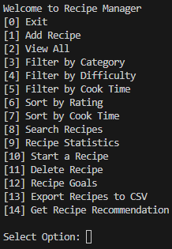
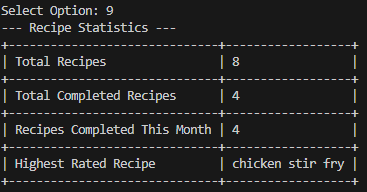
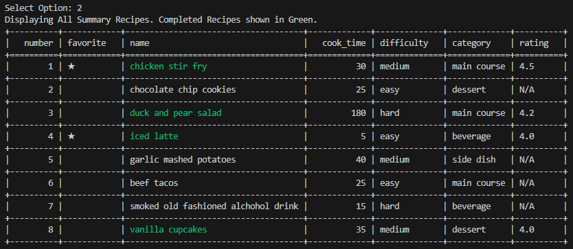

markdown

# Recipe List Tracker

A command-line recipe tracking application. User can create recipes, manage completed recipes, search recipes, set goals, and generate recipe statistics! I built this project to practice working with modular functions, saving/loading from files, and data logic.

## Features
- ➕ Add and delete recipes. User can add recipes including title, difficulty, category, rating, and tags. Multiple ingredients and instructions can be entered as nested lists inside each recipe.
- ⭐ Mark recipes as favorites.
- 🖥️ Sort and display recipes by multiple selected filters.
- 🏷  Tag recipes for custom organization. 
- 🔍 Search all recipes by any term.
- ✅ Mark recipes complete.
- 🎯 Track and display recipe completion goal.
- 📤 Export list of recipes to a CSV file.
- 🎲 User can receive a random recipe recommendation from the unfinished recipe list. If all recipes are finished then recommendation will be pulled from all recipes.
- 📊 Statistics report including total recipes, completed, and highest rated.


## How to Run
```
bash
git clone https://github.com/andreigurd/final-project
cd final-project
pip install tabulate
pip install colorama
python recipes.py
```
**Prerequisites:**
- Python 3.x
- pip packages: `tabulate` & `colorama` 

## 📸 Screenshots




## 🧠 What I Learned
- How to separate different display summary and detailed views was very valuable. This allowed for cleaner, more readable outputs for users.
- Managing nested data with multiple ingredients and amount dictionaries lists embedded within each recipe dictionary was difficult on this project. Calling on the ingredients values for logic and for displaying proved challenging.
- I would have approached the recipe goal feature differently. It would be helpful to allow user to select monthly and yearly recipe completion goals as well as allowing adding a number of recipes per month and per year.
- How to use random feature with validation to avoid issues to select from a user input list.

## 🔮 Future Improvements
- Edit recipe function.
- Multi user support with dedicated JSON files for each account.
- Allow for recipe recommendation based on user input on what ingredients are available.

## 🤝 Contributing
This is a learning project, but feedback is welcome!